<div align="center">

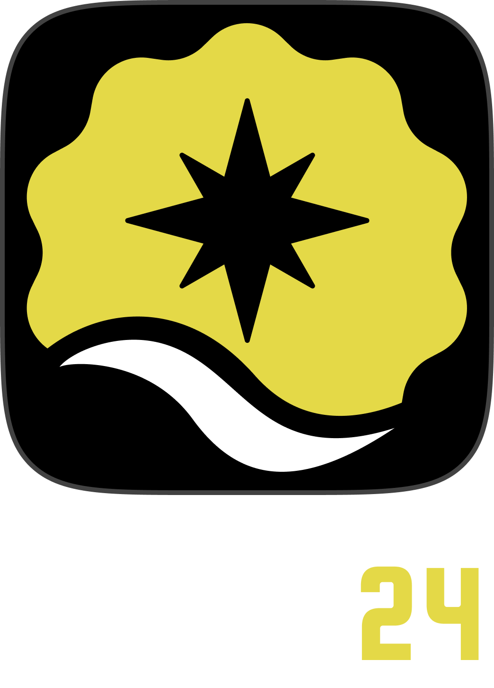

<p>
  <strong>A macOS cockpit for orchestrating multiple Claude agents in one window.</strong><br/>
  Run a fleet of AI agents. Chain them into pipelines. Review their diffs. Ship — without leaving the app.
</p>

  <p>
    <a href="https://github.com/eimis1990/inzone/releases/latest"></a>
    
    
    
    
    
  </p>

  <p>
    <a href="https://github.com/eimis1990/inzone/releases/latest"><strong>⬇ Download for macOS</strong></a>
    &nbsp;·&nbsp;
    <a href="#features">Features</a>
    &nbsp;·&nbsp;
    <a href="#quick-start">Quick start</a>
    &nbsp;·&nbsp;
    <a href="#everything-else">More features</a>
    &nbsp;·&nbsp;
    <a href="#for-developers">Build from source</a>
  </p>
</div>

<br/>

<p align="center">
  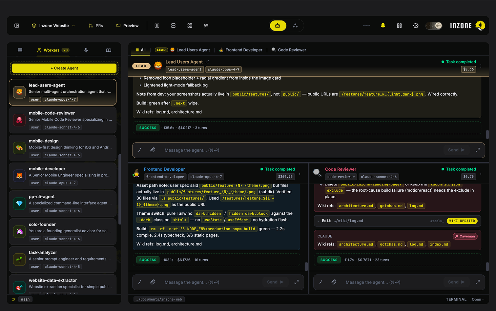
</p>

## Why INZONE24

Most AI coding tools give you one chat window with one agent. INZONE24 gives you a workspace.

You bind agents to panes, point each at the same project folder, and they work in parallel — a frontend agent on the UI, a backend agent on the API, a code-reviewer watching both. When you need something more structured, switch to **Lead** mode and let an orchestrator delegate to sub-agents through a built-in messaging protocol. When you need something pipelined, enable **Flow** and chain panes into a sequence that passes output downstream. When you need to review what they produced, the **Review** tab gives you per-hunk approve/reject and a one-click PR. All in one window.

Built for developers who use Claude as a teammate, not a tab.

<br/>

<table align="center">
  <tr>
    <td align="center"><strong>5+</strong><br/><sub>STARTER AGENTS</sub></td>
    <td align="center"><strong>8</strong><br/><sub>STARTER SKILLS</sub></td>
    <td align="center"><strong>4</strong><br/><sub>CLI TOOLS AS WORKERS</sub></td>
    <td align="center"><strong>0</strong><br/><sub>TELEMETRY · ACCOUNTS · LOCK-IN</sub></td>
  </tr>
</table>

<a id="features"></a>

## Features

### 01 · Multi-pane workspace — several agents, one window, zero context-switching

Split your project view into independent panes, each with its own agent and conversation. Agents run in parallel, see the same project folder, and can hand off work to each other through lightweight file conventions.

No more juggling six Claude tabs.

<p align="center">
  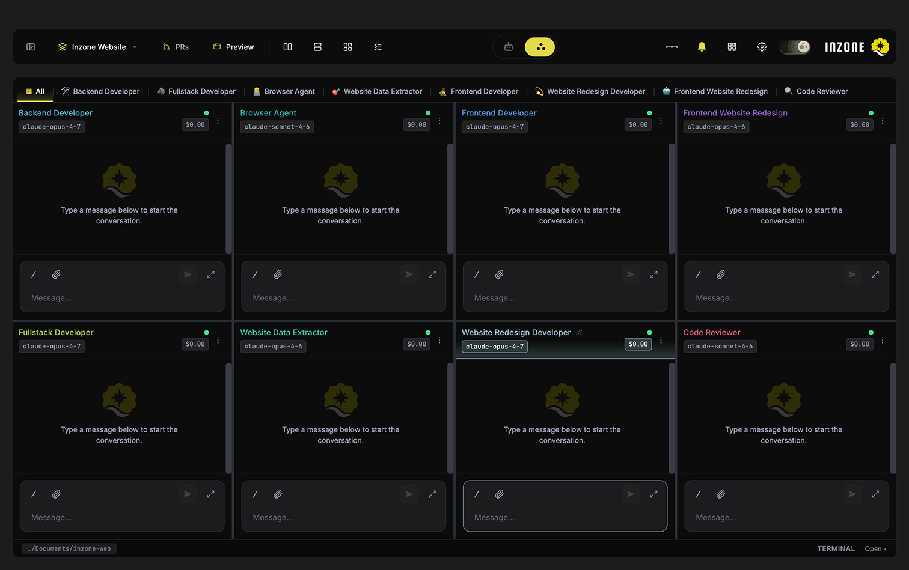
</p>

### 02 · Lead mode — one orchestrator, many sub-agents

Switch a project into Lead mode and the top pane becomes the orchestrator agent. It can spawn sub-agents, message them by name, watch their progress, and hand off tasks.

The same lightweight pattern Anthropic uses internally — without any of the plumbing.

<p align="center">
  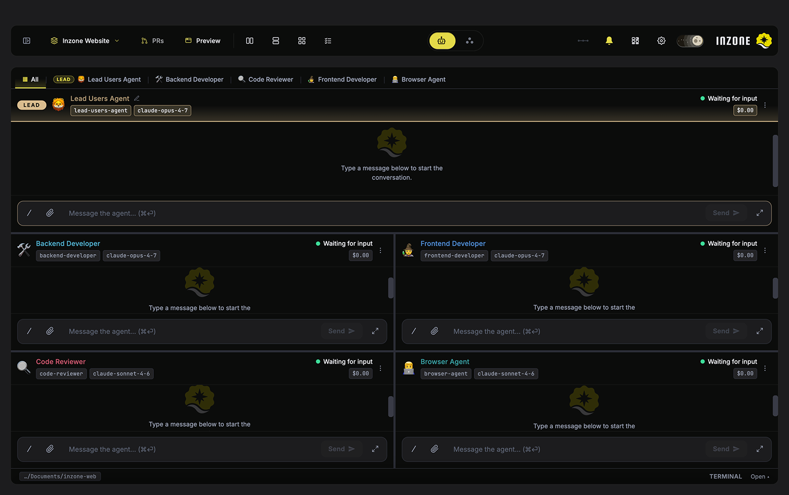
</p>

### 03 · Flow — chain your agents into pipelines

Build a sequential workflow on a free-form canvas. Each card is a pane with its own prompt; outputs flow forward via `{previous}`. Hit Run Flow and walk away.

Live logs surface in a side panel. n8n for AI agents — but the agents are real Claude SDK sessions doing real work.

<p align="center">
  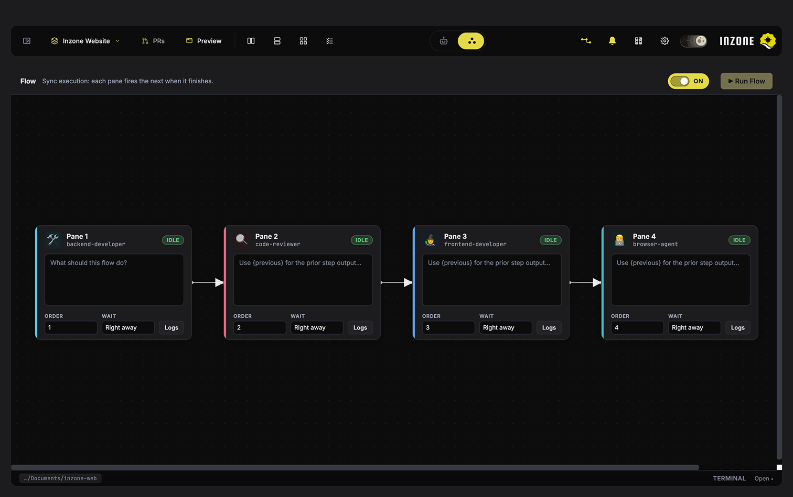
</p>

### 04 · Tasks — pre-wired templates for common workflows

Built-in task templates ship with the app — pre-wiring layouts, agent bindings, and prompts for common scenarios like Website Redesign, Mobile Feature, Greenfield Project, Bug Fix, Code Review, Browser Automation, and more. Lead-orchestrated templates carry a `LEAD` chip; multi-agent ones get a `MULTI` chip.

Capture your current session as a custom task to replay later. One click and you're back in the zone.

<p align="center">
  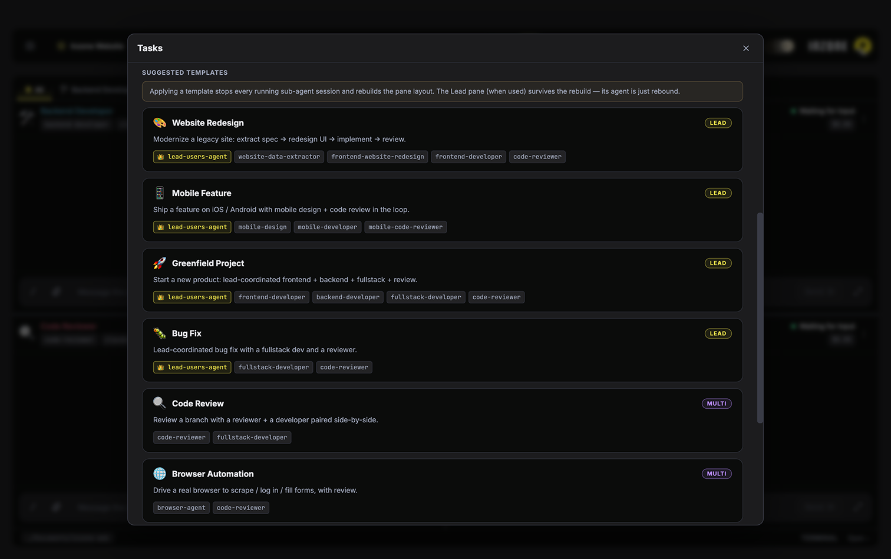
</p>

### 05 · Worktrees — parallel branches, zero conflicts

Spin up a git worktree off any branch directly from the sidebar. Several agents can work in parallel branches without stepping on each other's changes.

Optional prefixes and a `WT` chip keep your worktrees organized. INZONE24 cleans up when you're done.

<p align="center">
  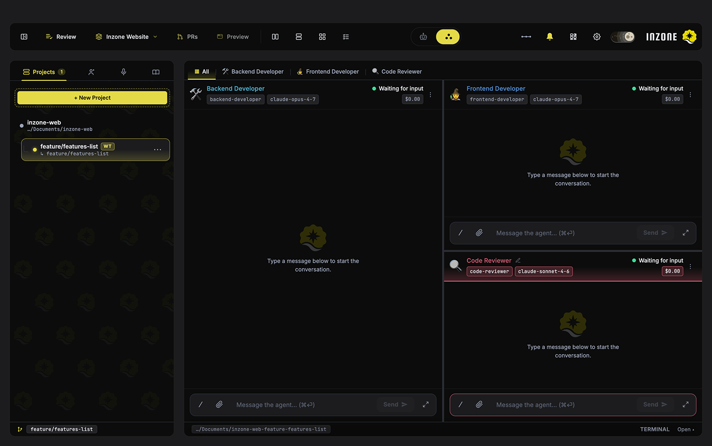
</p>

### 06 · Diff review + PR — review, approve, ship without leaving the app

The Review tab shows a side-by-side or inline diff with per-hunk approve/reject controls. Send feedback back to the agent for revision loops.

When the work is ready, one click opens a PR via the `gh` CLI. INZONE24 handles the rest — title and body are auto-drafted from the diff.

<p align="center">
  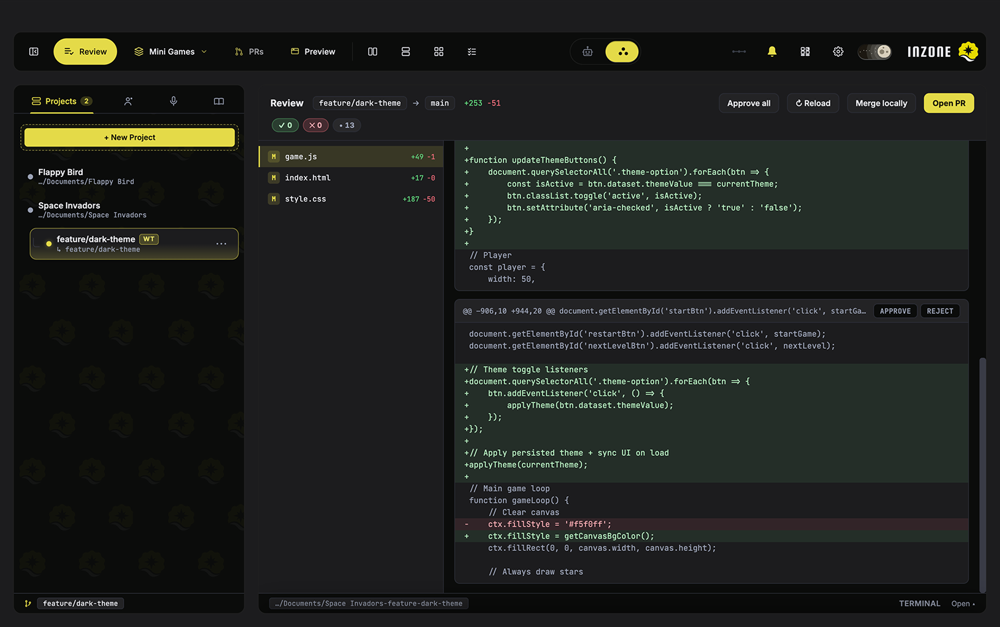
</p>

### 07 · Mission Control — every agent, every project, one glance

`⌘⇧M` opens a full-screen overview of every project across your active workspace — agents, status, current tool, cost, last activity.

Click a pane to jump to it. The closest thing to a process monitor for AI agents.

<p align="center">
  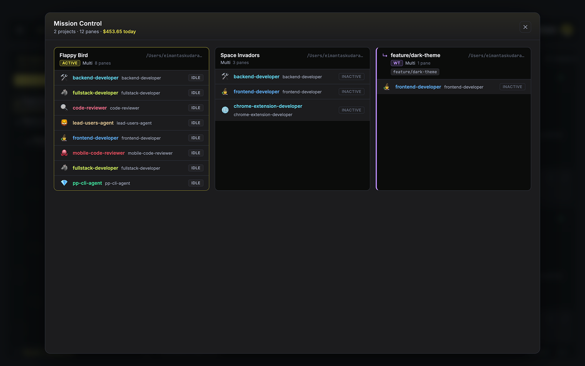
</p>

### 08 · Preview — localhost in the app, no tab-switching

An in-app browser auto-detects localhost URLs from your project. The card swaps in next to your panes with a real toolbar: back / forward / reload, address bar, seven-step zoom (`⌘+` / `⌘-` / `⌘0`), a 375px mobile-viewport simulator, reload-on-save (chokidar watches your sources), and inline DevTools.

Multi-URL picker when several dev servers are running. Port-kill action built in.

<p align="center">
  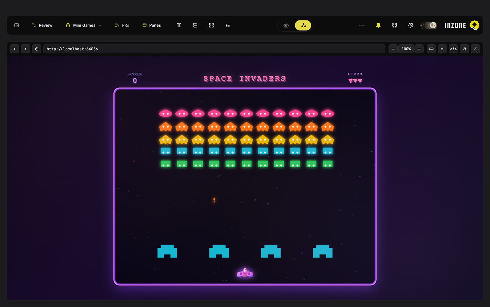
</p>

### 09 · Terminal — a real shell inside every pane

A full PTY terminal (zsh/bash) with ANSI color support, WebGL-accelerated rendering, and persistent state across sessions. Add customizable shortcut buttons for your most-used commands (Run Serve, Run Dev, Kill Port 3000, Git Pull Origin, Expo Login, …) right above the terminal.

Your agents can run shell commands; so can you.

<p align="center">
  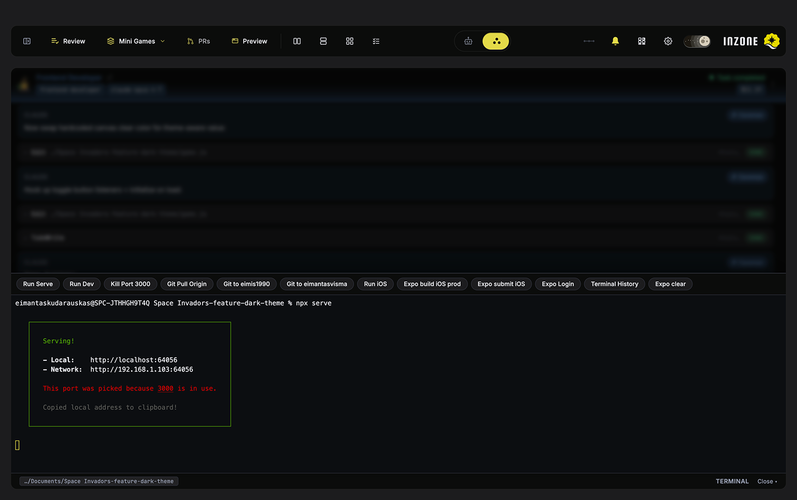
</p>

### 10 · Project wiki — living documentation your agents read and write

A markdown wiki at `.inzone/wiki/` that agents can edit, query, and cite. A bundled, non-overridable agent protocol auto-injects into every agent's system prompt the moment a project initialises its wiki — making sure the wiki actually gets updated after every code-touching task, not just when the user remembers to ask.

Schema enforcement, structured ingestion, linting, and wiki-grounded voice Q&A. Your project knowledge, always up to date.

<p align="center">
  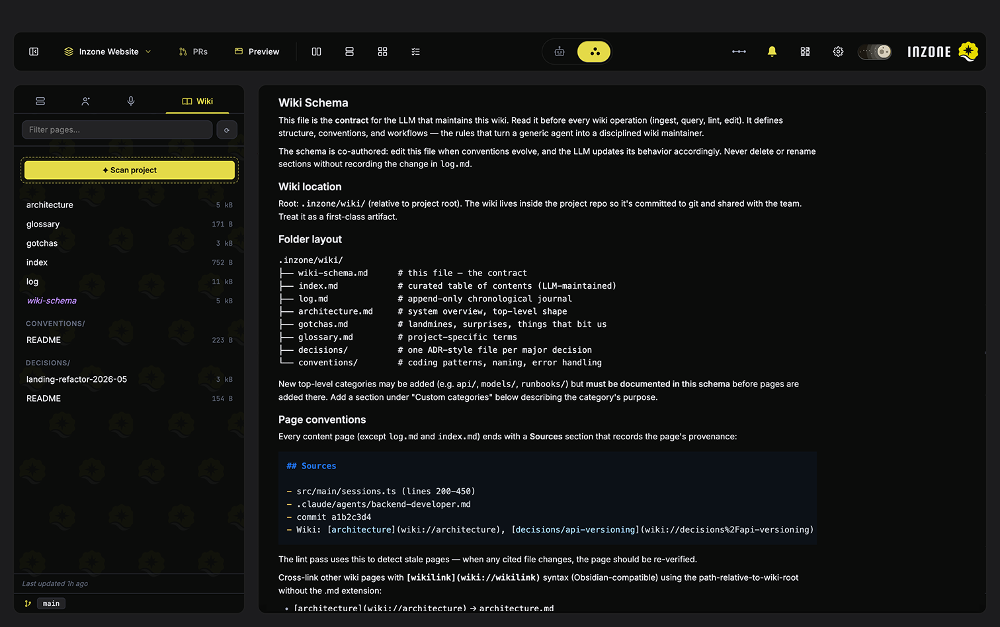
</p>

### 11 · Voice — talk to your fleet

> "Spin up a frontend agent on this folder."<br/>
> "Tell the backend agent to add the auth endpoint."<br/>
> "What did the reviewer say?"

Drive INZONE24 by voice with ElevenLabs Conversational AI. Pane creation, mode switching, project switching, wiki queries with citations, reading agent responses aloud — all hands-free. Bring your own ElevenLabs account.

<p align="center">
  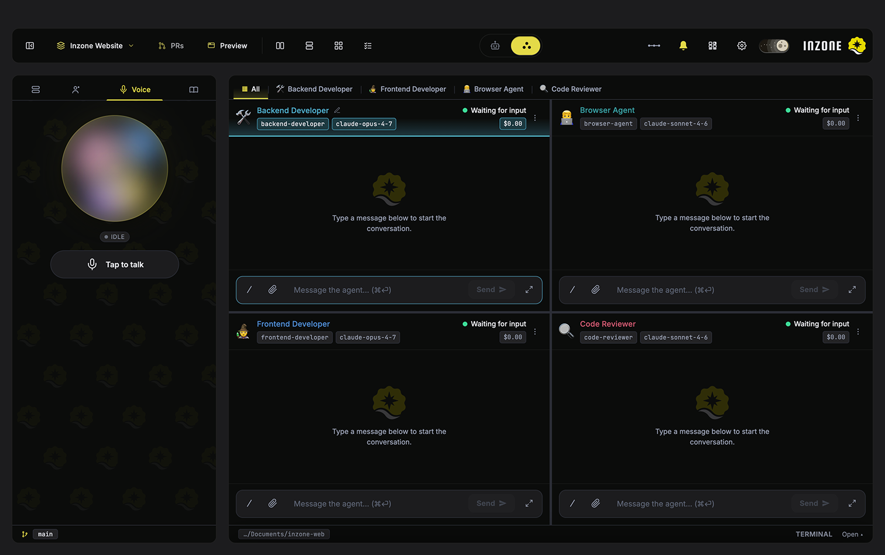
</p>

### 12 · Plugins + Marketplaces — install agents, skills, commands, MCPs in one bundle

Browse, install, and toggle Claude Code plugins from inside the app — bundles that can contribute any combination of agents, skills, slash commands, MCP servers, and hooks. Anthropic's official marketplace ships as a recommended starter; add any third-party marketplace by URL.

Activation is per-plugin and mirrors into Claude Code's `~/.claude/settings.json`, so the two apps stay in sync.

<p align="center">
  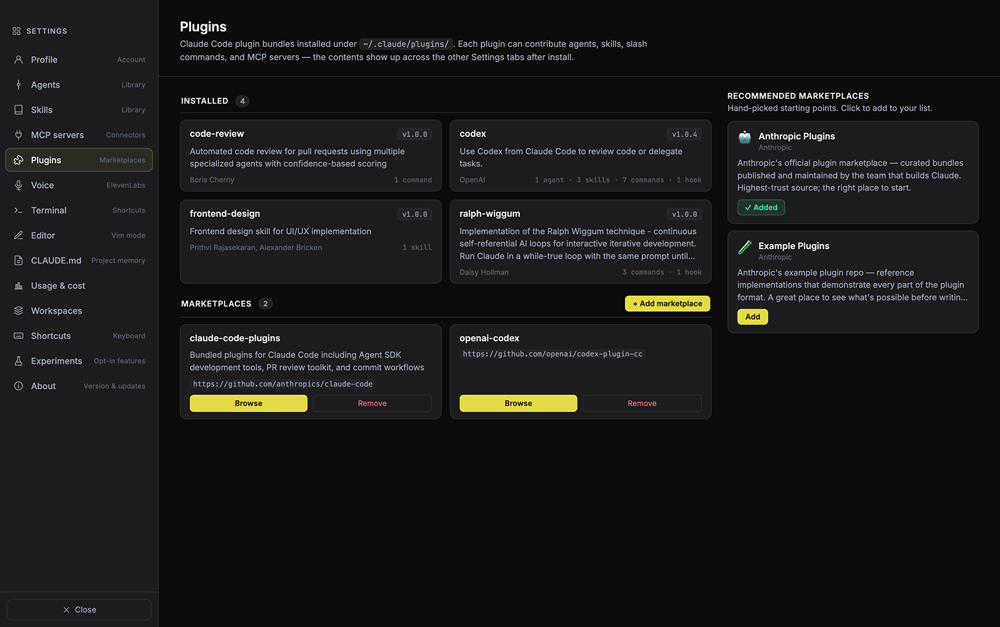
</p>

### 13 · Slash commands — project, user, plugin, and built-in commands in one picker

`/` in the composer opens a searchable popover with every slash command available to the active pane's project. Sources merge in priority order: project-local commands → your user commands → plugin commands → five built-in starters (`/plan`, `/think`, `/review`, `/explain`, `/test`).

Pick a command, type your arguments, send. Templates with `$ARGUMENTS` get expanded automatically.

<p align="center">
  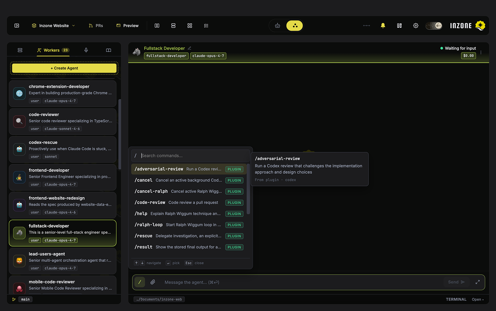
</p>

### 14 · Workers tab — agents and CLI tools share one shelf

Drop a Claude agent on a pane to chat with it; drop Claude Code, Codex CLI, Aider, Gemini CLI, or a plain shell on a pane to embed that tool right in the layout.

Same drag, same surface — choose the right tool for each task. Install detection flags missing binaries with a one-click guided install path.

<p align="center">
  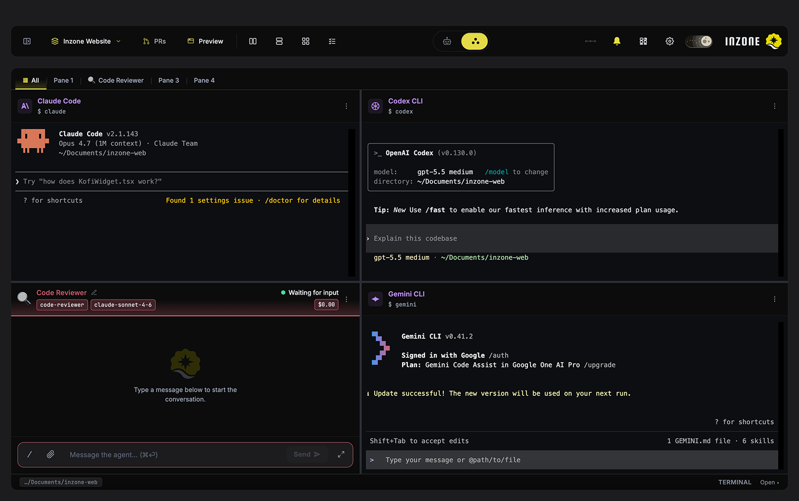
</p>

### 15 · In-app agent + skill editor — author your own, your way

Edit (or create) any agent without leaving the app. The drawer covers identity (name, emoji, vibe), capabilities (model + tool / skill / MCP allowlists), appearance (12-colour palette), and the full system prompt in a CodeMirror Markdown editor. An "AI-generate prompt" button drafts a polished system prompt from the agent's name + description when you don't want to start from a blank page.

The same editor pattern works for skills.

<p align="center">
  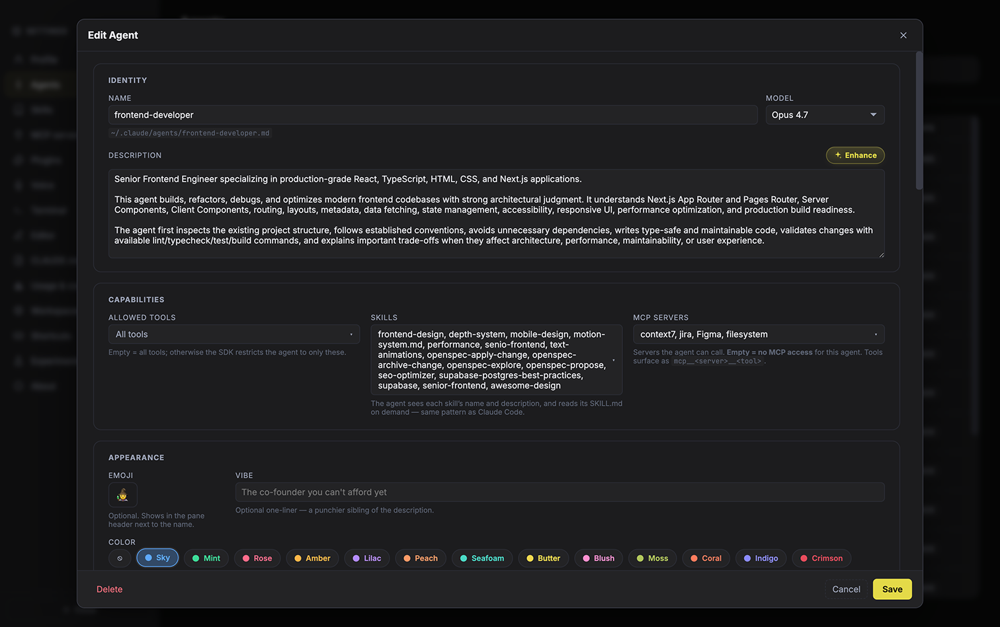
</p>

<a id="everything-else"></a>

## Everything else

The features above are the headliners. Plenty more is wired into the app:

- **MCP servers + Recommended MCPs** — OAuth-integrated MCP servers for Figma, JIRA, Linear, Atlassian, Notion, GitHub, Filesystem, and custom endpoints. A Recommended MCPs rail ships 13 one-click installs covering both local stdio servers (Filesystem, Playwright, Brave Search, PostgreSQL, etc.) and remote OAuth connectors. Tokens encrypted in the macOS keychain. Per-agent opt-in.
- **Layouts** — named pane-tree presets separate from Tasks. Switch between 1, 2, 4, 6, 8, or 10-pane grids instantly, or save your own arrangements for different work modes.
- **Pane focus + ⌘F fullscreen** — a horizontal tab strip under the workspace bar lets you fullscreen any pane while the others keep running invisibly in the background. ⌘F to focus, ⌘F again to return.
- **Multi-project workspaces** — group related projects; switch the whole context with one click. Inactive projects keep streaming in the background.
- **Recommended Skills** — curated one-click skills (VoltAgent Awesome Design, Printing Press, Slack, Linear, Stripe, Notion, Figma, X/Twitter, Firecrawl, and more). Setup guides for ones that need API keys.
- **CLAUDE.md memory** — per-project and global memory files injected into every agent's system prompt, with a scope picker.
- **Cost & usage telemetry** — live per-pane, per-project, and global cost counters. Settings → Usage breaks totals down by day, agent, and model.
- **AskUserQuestion** — agents can render a structured multi-choice form to you instead of guessing or rambling in prose.
- **Caveman Mode (experimental)** — optional token-compression layer cuts ~65–75% of natural-language tokens in assistant replies. Code, paths, and identifiers preserved verbatim.
- **Light + Dark themes** — warm paper-and-ink light, deep slate + amber dark, live toggle in the workspace bar. Every surface adapts.
- **Vim mode** — Settings → Editor toggle applies modal editing to every CodeMirror surface (agent prompts, wiki, CLAUDE.md, MCP JSON). Synced across windows.
- **Image attachments** — drop, paste, or attach PNG/JPEG/WEBP/GIF in the composer. Vision-capable models see them as part of the user turn.
- **Keyboard polish** — Settings → Shortcuts reference with platform-aware glyphs; auto-scroll pin with "Jump to latest" pill; collapsing tool-call rows; ⌘P swap panes ↔ preview, ⌘S Settings, ⌘M toggle Multi/Lead, ⌘⇧M Mission Control, ⌘T terminal, ⌘F fullscreen pane.

For the full feature list and design notes see [FEATURES.md](FEATURES.md).

<a id="quick-start"></a>

## Get started in three steps

From download to your first agent conversation in under a minute.

**1. Download** — [DMG for Apple Silicon or Intel](https://github.com/eimis1990/inzone/releases/latest). Drag to Applications.

**2. Sign in to Claude** — paste your API key from `console.anthropic.com` into Settings → Profile, **or** run `claude login` from the Claude Code CLI and INZONE24 picks up the credentials automatically. Either works.

**3. Open a project** — pick a folder, split into panes, drop agents in, start working.

## Honest comparison

Different tools excel at different things. Here's where INZONE24 fits.

| Use case | INZONE24 | Claude Code | Cursor |
| --- | :---: | :---: | :---: |
| Single agent, fast feedback loop | ✓ | ✓✓ | ✓✓ |
| Multiple agents in parallel | ✓✓ | — | — |
| Sequential pipelines (Flow) | ✓✓ | — | — |
| Voice control | ✓✓ | — | — |
| Inline diff review + 1-click PR | ✓✓ | — | ✓ |
| Project wiki agents maintain | ✓✓ | — | — |
| Built-in IDE features (lints, etc.) | — | — | ✓✓ |

<sub>— not really · ✓ supported · ✓✓ shines here</sub>

## Privacy & ownership

Your code never leaves your laptop.

All transcripts, agent definitions, MCP configs, OAuth tokens (encrypted via macOS keychain), preview cookies, voice settings, and pipeline state live on your machine. The only data that leaves goes to:

- **Anthropic** — the prompts you send to Claude, billed against your subscription or API key
- **ElevenLabs** — voice prompts, only if you enable the Voice agent
- **MCP server endpoints you explicitly add** — under your control, per-agent opt-in
- **The auto-update feed** — version check; the binary itself is signed and notarized

No analytics. No cloud account. No lock-in.

## Compatibility with Claude Code

INZONE24 reads the same configuration directories Claude Code uses:

- `~/.claude/agents/` — global agent definitions
- `~/.claude/skills/` — global skill definitions
- `<project>/.claude/agents/` — project-scoped agents
- `<project>/CLAUDE.md` and `~/.claude/CLAUDE.md` — memory files
- `<project>/.mcp.json` — project-local MCP servers
- `~/.claude.json` — project-other MCP servers
- `~/.claude/plugins/` + `~/.claude/settings.json` `enabledPlugins` — plugin install state

Whatever you've already set up for Claude Code keeps working.

## Requirements

- macOS 12 or later (Apple Silicon or Intel)
- A Claude API key (`console.anthropic.com`) **or** an active Claude Code subscription
- *(Optional)* An ElevenLabs account for the Voice agent
- *(Optional)* `gh` CLI installed for the one-click PR flow

<a id="for-developers"></a>

## For developers

INZONE24 is open source. To run from source:

```bash
git clone https://github.com/eimis1990/inzone.git
cd inzone
npm install
npm run dev          # HMR dev mode
```

Useful scripts:

```bash
npm run typecheck    # tsc --noEmit for main + renderer
npm run build        # production bundle into out/
npm run package      # build a signed .zip via electron-builder (requires Apple Dev ID env vars)
npm run package:dir  # build an unsigned .app for local testing — fastest iteration
```

### Architecture at a glance

```
┌──────────────────────────────────────────────────────────────┐
│ Renderer (React + Zustand)                                   │
│   ┌─────────────┬────────────────────────────────────────┐   │
│   │ Sidebar     │ Pane tree (resizable splits)           │   │
│   │ Projects /  │  ┌────────┬────────┐                   │   │
│   │ Workers /   │  │ Pane A │ Pane B │  …                │   │
│   │ Voice       │  └────────┴────────┘                   │   │
│   │             │ Workspace bar · Flow canvas · Review   │   │
│   └─────────────┴────────────────────────────────────────┘   │
│                    │ ipc invoke / on                          │
└────────────────────┼─────────────────────────────────────────┘
                     ▼
┌──────────────────────────────────────────────────────────────┐
│ Main process (Node)                                          │
│   IPC handlers   ─►  SessionPool                             │
│                       ├── SessionController (pane A)         │
│                       │    └─ @anthropic-ai/claude-agent-sdk │
│                       └── SessionController (pane B) …       │
│   Agents/skills watcher · MCP loader · Git ops · PTYs        │
│   Plugins loader · AskUserQuestion in-process MCP server     │
│   Preview chokidar watcher · Auto-update                     │
│   Persistence (electron-store + JSONL transcripts)           │
└──────────────────────────────────────────────────────────────┘
```

Core stack: **Electron + TypeScript + React + Zustand**, `@anthropic-ai/claude-agent-sdk` for agent runtime, `react-resizable-panels` for tiled splits, `node-pty` + `xterm.js` for terminals, `chokidar` for the preview reload-on-save, `electron-builder` for packaging, `electron-updater` for in-app updates.

For a deeper feature list see [FEATURES.md](FEATURES.md). For the release flow see [RELEASE.md](RELEASE.md).

## License

MIT — see [LICENSE](LICENSE).

---

<p align="center">
  <sub>Built for people who treat Claude as a team, not a chatbot.</sub>
</p>
