<div align="center">
  

  <h1>INZONE</h1>

  <p>
    <strong>A macOS cockpit for orchestrating multiple Claude agents in one window.</strong><br/>
    Run several agents in parallel, chain them into pipelines, isolate work in git worktrees,
    and ship code without ever leaving the app.
  </p>

  <p>
    <a href="https://github.com/eimis1990/inzone/releases/latest"></a>
    
    
    
    
  </p>

  <p>
    <a href="https://github.com/eimis1990/inzone/releases/latest"><strong>⬇ Download for macOS</strong></a>
    &nbsp;·&nbsp;
    <a href="#features">Features</a>
    &nbsp;·&nbsp;
    <a href="#quick-start">Quick start</a>
    &nbsp;·&nbsp;
    <a href="#for-developers">Build from source</a>
  </p>
</div>

<br/>

<p align="center">
  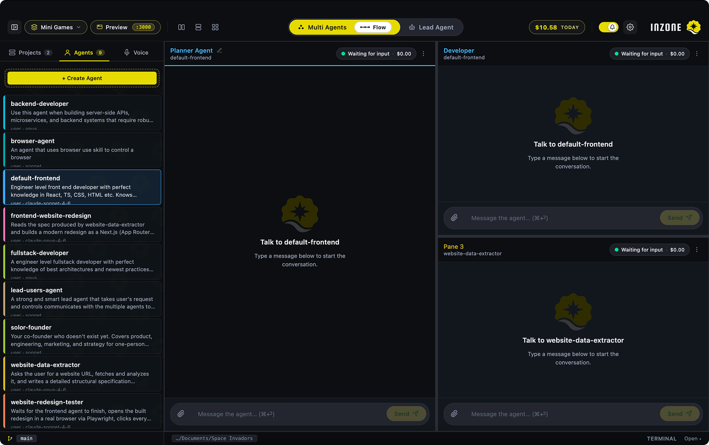
</p>

## Why INZONE

Most AI coding tools give you one chat window with one agent. INZONE gives you a workspace.

You bind agents to panes, point each at the same project folder, and they work in parallel — a frontend agent on the UI, a backend agent on the API, a code-reviewer watching both. When you need something more structured, switch to **Lead** mode and let an orchestrator delegate to sub-agents through a built-in messaging protocol. When you need something pipelined, enable **Flow** and chain panes into a sequence that passes output downstream.

INZONE is local-first. Your agent definitions, transcripts, and credentials live on your machine. The only data that leaves goes to Anthropic (for Claude turns) and any MCP servers you explicitly add.

It's compatible with Claude Code's `~/.claude/` directory, so any agents and skills you've already authored work here unchanged.

<a id="features"></a>

## Features

### Multi-Agent Workspace

Drop several Claude agents into independent panes inside one window. Each pane has its own conversation, transcript, and SDK session, so agents can work on different parts of the same project in parallel without stepping on each other. Splitters resize panes live; pre-built grids (1, 2, 4, 6, 8, 10-pane) are one click away in [Layouts](#layouts--save-your-pane-setups), and [Tasks](#tasks--one-click-mission-setups) bundle a layout with the right agents already assigned.

<p align="center">
  
</p>

### Lead Agent — Delegate, Don't Micromanage

Promote one pane to a top-row orchestrator. The Lead agent sees a custom MCP toolset for assigning work, asking questions, and broadcasting context to its sub-agents. You write the goal once; the Lead figures out who does what and routes results back. Switch between Multi and Lead with a single segmented control in the workspace bar.

<p align="center">
  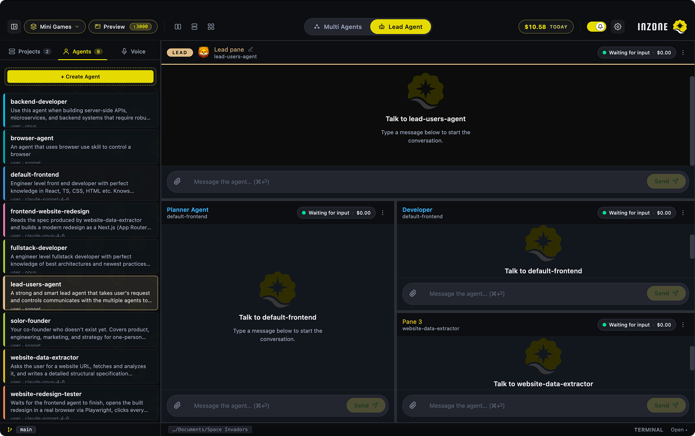
</p>

### Flow — Sequential Agent Pipelines

Chain panes into a synchronous sequence. Each step fires the next as soon as it finishes, passing the previous agent's output downstream via a `{previous}` placeholder. Authored on a free-form canvas with draggable cards, bezier connection lines, per-card prompts, configurable per-step delay, and a live logs side panel with autoscroll. Toggle Flow off and the cards lock; pane composers reclaim message authoring.

<p align="center">
  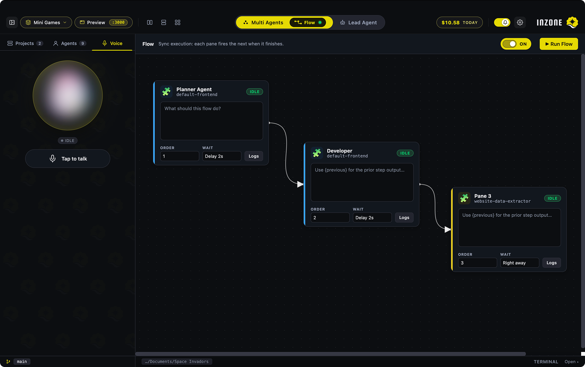
</p>

### Tasks — One-Click Mission Setups

Spin up the right multi-pane setup for the work you're about to do — no manual splitting, no manual agent assignment. Nine built-in task templates ship with the app ("Build a feature", "Fix a bug", "Code review", "Ship to production", and more), each pre-wiring the pane layout and dropping the appropriate agents into each slot. Pick one, click apply, start working.

Save your own setups too: the "current session" card at the top of the modal captures your live pane tree + agent bindings as a reusable template. Templates that reference agents you've since deleted are flagged with a red ✗ chip and disabled rather than silently breaking — you'll know exactly what's wrong before you click.

<p align="center">
  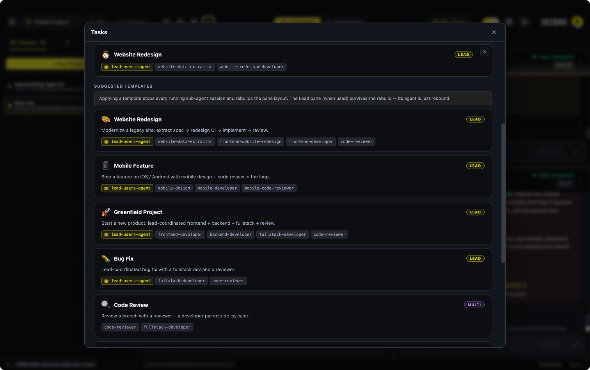
</p>

### Layouts — Save Your Pane Setups

Named pane-tree presets, separate from Tasks. Where Tasks bundle a layout *plus* agent assignments, Layouts are just the shape — useful when you want the same arrangement (a 2x2 grid, a triangle review, a wide-and-narrow split) but plan to drop different agents in each session. Apply a layout and your current panes rearrange in place; agents already running keep their transcripts and stay attached to their new slots.

<p align="center">
  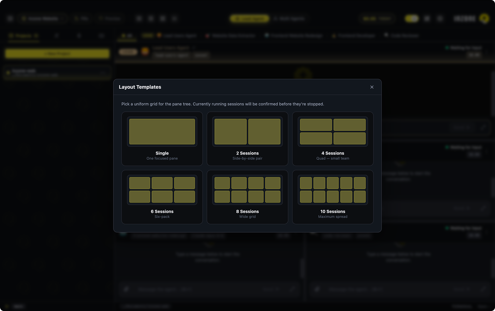
</p>

### Pane Focus Tabs + Fullscreen

A horizontal tabs strip below the workspace bar gives you one tab per pane plus an "All" tab. Click a pane tab to fullscreen that pane — every other agent keeps running in the background, transcripts intact, just not visible. Click "All" to return. Press `⌘F` to toggle fullscreen on whichever pane is active. Each tab carries the agent's emoji and a soft agent-coloured underline when selected, so a 6-pane workspace stays scannable instead of a blur of identical headers.

<p align="center">
  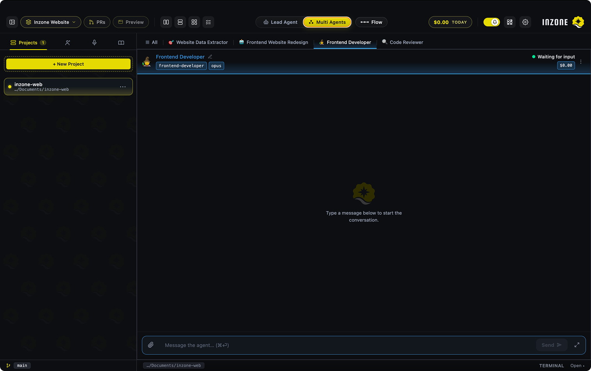
</p>

### Worktrees — Parallel Branches Without Stepping On Yourself

Spin up a git worktree off any branch directly from the sidebar. INZONE creates a sibling directory with its own branch (with optional `feature/`, `fix/`, `chore/`, `experiment/` prefix) and registers it as a sister project under the parent, indented in the sidebar with a "WT" chip. Run several agents on different branches of the same repo in parallel without them clobbering each other's working trees.

<p align="center">
  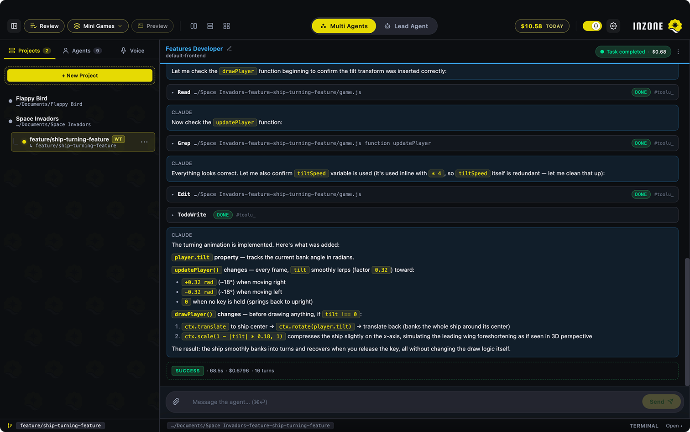
</p>

### Built-In Diff Review + PR Workflow

The second half of the worktree story. A Review chip in the workspace bar opens a per-pane file tree of changes with a side-by-side / inline diff viewer. Per-hunk approve/reject. Rejected hunks plus a comment can be sent back to the agent for revision. Once clean, **Open PR** detects `gh` CLI, supports multi-account push, switches SSH-only remotes to HTTPS for you, and drafts the PR title/body from the diff. After merge, INZONE pulls into the parent project, removes the worktree, and switches you back.

<p align="center">
  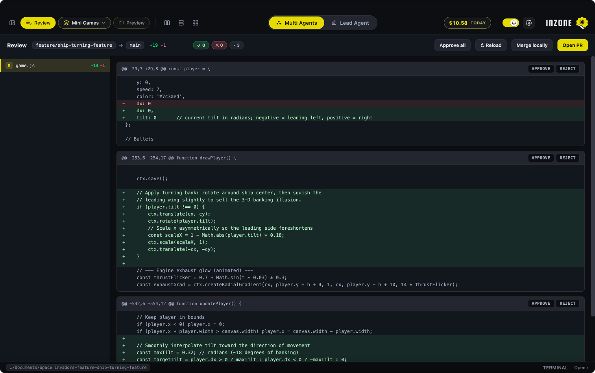
</p>

### Built-In Terminal

A real PTY shell (zsh/bash via node-pty) docked at the bottom of the pane host. `⌘T` toggles a slide-up overlay with a blurred backdrop. Full ANSI color support, interactive programs, persistent across panel open/close. Configurable shortcut buttons for quick commands like `npm run dev` or `git status`. Terminal cwd follows the active project's folder automatically. GPU-accelerated WebGL renderer (with graceful canvas2d fallback) keeps scrolling smooth even under heavy output like `npm install` or full test runs.

<p align="center">
  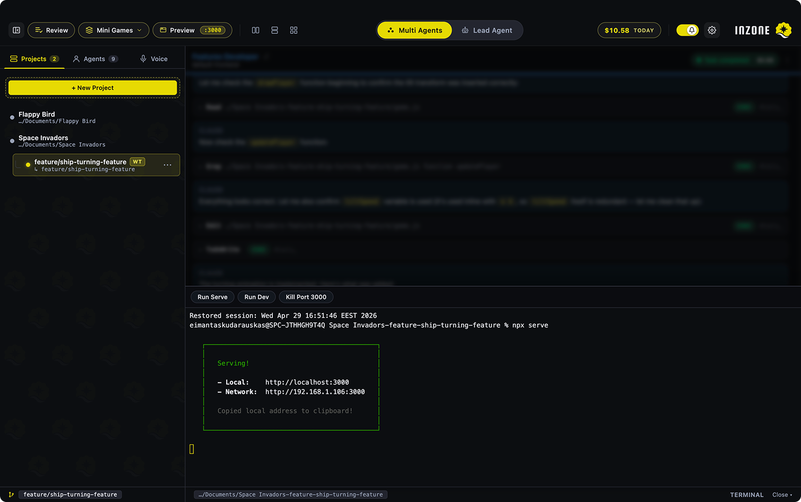
</p>

### Preview Window

In-app browser for localhost. INZONE auto-detects URLs printed by agents *and* by the terminal, surfaces a Preview pill in the workspace bar, and opens a centered 16:10 webview at 90% viewport with `⌘⇧P`. Multi-URL picker when several services are running, with a kill action to free a port. Liveness sweeps prune URLs that no longer respond.

<p align="center">
  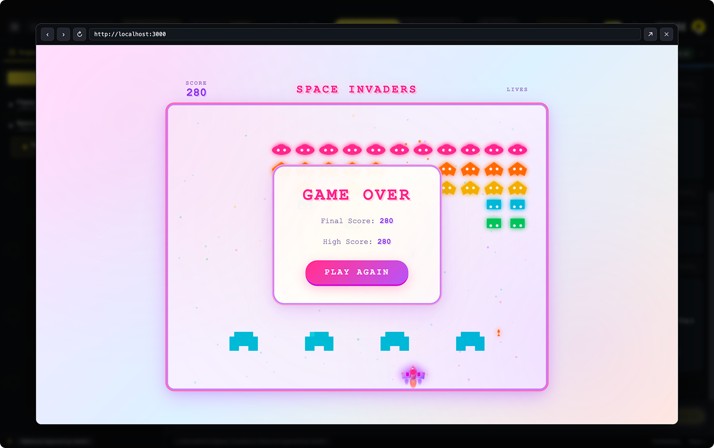
</p>

### Project Wiki — LLM-Maintained Knowledge Base

A persistent, agent-editable wiki that lives at `.inzone/wiki/` inside your project (committed to git, shared with the team). Inspired by Andrej Karpathy's "LLM Wiki" pattern. One click initialises a starter scaffold (architecture, glossary, gotchas, decisions, conventions) plus a schema file that defines the conventions agents must follow. **Scan project** drops a structured ingest prompt into the focused agent so it populates the pages from your real source. After that, every agent session automatically gets the schema + curated index injected into its system prompt, plus instructions to update pages as it learns — edits show up as visible Write/Edit tool calls in the transcript. **Lint** audits Sources cites, flags stale / orphan / broken-wikilink pages. A built-in markdown editor and an activity dashboard (page count, recent ingests, recent edits) round out the loop.

<p align="center">
  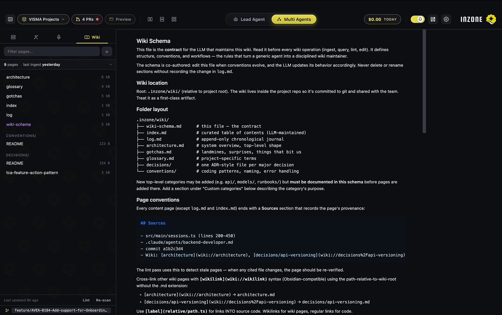
</p>

### Voice Agent — Drive INZONE Hands-Free

A dedicated voice agent (powered by ElevenLabs Conversational AI) that operates the rest of INZONE for you. Tap the mic in the sidebar, ask in plain English, and it calls real INZONE actions on your behalf:

- **"Spin up a frontend agent and a backend agent side by side"** — splits the pane tree and binds the matching agents
- **"Switch to Lead mode and promote the frontend agent"** — flips the workspace mode and sets the orchestrator
- **"Send the diff review notes to the backend pane"** — routes a message into a specific pane's composer
- **"What's the architecture of this project?"** — reads `.inzone/wiki/` and answers from your documented source, with proper citations to the wiki pages it pulled from

The wiki Q&A is the big one: the voice agent has `list_wiki_pages`, `read_wiki_page`, and `search_wiki` tools, so it grounds project questions in *your* committed documentation rather than guessing from training. Ask it a real codebase question while you're walking around, away from the keyboard.

API key encrypted at rest in macOS keychain via Electron `safeStorage`. A three-slide setup wizard walks first-time users through getting it configured.

<p align="center">
  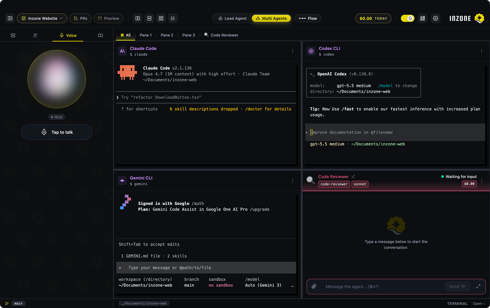
</p>

### Workers Tab — Agents + CLI Tools In One Place

The middle sidebar tab houses both LLM agents and non-agent CLI tools. The **Other** section ships with presets for **Claude Code**, **Codex CLI**, **Aider**, **Gemini CLI**, **Printing Press** (browse / install / mint agent-native CLIs from [printingpress.dev](https://printingpress.dev/)), plus a plain **Terminal**. Drop one onto a pane and it flips from a chat surface into an embedded shell running that tool. Install detection shows a "not installed" pill with a one-click install path that types the right command into the bottom-bar terminal — no tab switching.

### MCP Server Support

Connect external MCP servers — Figma, JIRA, Atlassian, Context7, Supabase, GitHub, Filesystem, custom. Built-in OAuth flow (PKCE + localhost callback) for connectors that need it. Tokens persist in macOS keychain via `safeStorage`. Per-agent opt-in keeps each agent's toolbox focused. Reads MCP servers from Claude Code's project-local and project-other config files automatically.

### Bundled Starter Library

On first launch, INZONE copies a curated set of starter agents and skills into `~/.claude/` — never overwriting anything you've authored:

- **5 starter agents**: backend-developer, fullstack-developer, frontend-developer, solo-founder, lead-users-agent
- **8 starter skills**: code-reviewer, frontend-design, mobile-design, motion-system, senior-frontend, senior-fullstack, senior-prompt-engineer, seo-optimizer

Plus a **Recommended skills** section in Settings → Skills with one-click install of curated community skills (starting with VoltAgent's Awesome Design — 55+ reverse-engineered brand design systems as Claude skills). Installs are idempotent shallow git clones into `~/.claude/skills/` — no overwrite of anything you've authored.

### Vim Mode + Editor Preferences

A Vim mode toggle in Settings → Editor turns on modal editing across every CodeMirror surface in the app: the agent / skill prompt editor, the wiki page editor, the CLAUDE.md editor, and the MCP raw-JSON view. Normal / insert / visual modes, registers, marks, search, and dot-repeat all work — backed by `@replit/codemirror-vim`. Off by default. Toggle takes effect immediately in every open editor (and across every open INZONE window) without a reload. Settings → Shortcuts has the full keyboard reference, with modifier glyphs that match your OS.

### Project Resume + Auto-Update

Pane layouts, agent assignments, transcripts, Claude SDK session ids, mode (Multi or Lead), Lead-pane history, terminal-pane preset bindings, and pipeline configuration all persist across restarts. Reopen the app and the same agents are right where you left them with full context intact.

`electron-updater` checks the release feed every 30 minutes and silently downloads new versions in the background. When a download completes, you get a small "Update ready" prompt with Restart now / Later — never a forced restart.

<a id="quick-start"></a>

## Quick start

1. **[Download the latest release](https://github.com/eimis1990/inzone/releases/latest)** — pick the Apple Silicon zip if you're on M-series, the Intel zip otherwise.
2. **Unzip and drag `INZONE.app` to Applications.** Safari unzips automatically; right-click → Open the first time if Gatekeeper hesitates (it shouldn't — the build is notarized).
3. **First launch — choose your auth path:**
   - **API key**: paste your Claude API key from `console.anthropic.com` into Settings → Profile. Encrypted at rest in macOS keychain.
   - **Subscription**: if you've already run `claude login` from the Claude Code CLI, INZONE picks up the credentials automatically.
4. **Pick a project folder** in the welcome modal. Every pane in that project will run with that folder as its working directory.
5. **Drop an agent on a pane** — the Workers tab shows your library. Click any card to bind it.
6. **Open another pane** with one of the layout templates (1, 2, 4, 6, 8, 10) and let two agents go at it in parallel.

That's it. From there, explore Lead mode, Flow, worktrees, the Review chip, and the Voice setup wizard at your own pace.

## Requirements

- macOS 12 or later (Apple Silicon or Intel)
- A Claude API key (`console.anthropic.com`) **or** an active Claude Code subscription
- (Optional) An ElevenLabs account for the Voice agent
- (Optional) `gh` CLI installed for the one-click PR flow

<a id="for-developers"></a>

## For developers

INZONE is open source. To run from source:

```bash
git clone https://github.com/eimis1990/inzone.git
cd inzone
npm install
npm run dev          # HMR dev mode
```

Other useful scripts:

```bash
npm run typecheck    # tsc --noEmit for main + renderer
npm run build        # production bundle into out/
npm run package      # build a signed .zip via electron-builder (requires Apple Dev ID env vars)
npm run package:dir  # build an unsigned .app for local testing — fastest iteration
```

### Architecture at a glance

```
┌──────────────────────────────────────────────────────────────┐
│ Renderer (React + Zustand)                                   │
│   ┌─────────────┬────────────────────────────────────────┐   │
│   │ Sidebar     │ Pane tree (resizable splits)           │   │
│   │ Projects /  │  ┌────────┬────────┐                   │   │
│   │ Workers /   │  │ Pane A │ Pane B │  …                │   │
│   │ Voice       │  └────────┴────────┘                   │   │
│   │             │ Workspace bar · Flow canvas · Review   │   │
│   └─────────────┴────────────────────────────────────────┘   │
│                    │ ipc invoke / on                          │
└────────────────────┼─────────────────────────────────────────┘
                     ▼
┌──────────────────────────────────────────────────────────────┐
│ Main process (Node)                                          │
│   IPC handlers   ─►  SessionPool                             │
│                       ├── SessionController (pane A)         │
│                       │    └─ @anthropic-ai/claude-agent-sdk │
│                       └── SessionController (pane B) …       │
│   Agents/skills watcher · MCP loader · Git ops · PTYs        │
│   AskUserQuestion in-process MCP server                      │
│   Auto-update (electron-updater)                             │
│   Persistence (electron-store + JSONL transcripts)           │
└──────────────────────────────────────────────────────────────┘
```

Core stack: **Electron + TypeScript + React + Zustand**, `@anthropic-ai/claude-agent-sdk` for agent runtime, `react-resizable-panels` for tiled splits, `node-pty` + `xterm.js` for terminals, `electron-builder` for packaging, `electron-updater` for in-app updates.

For a deeper feature list see [FEATURES.md](FEATURES.md). For the release flow see [RELEASE.md](RELEASE.md).

## Compatibility with Claude Code

INZONE reads the same configuration directories Claude Code uses:

- `~/.claude/agents/` — global agent definitions
- `~/.claude/skills/` — global skill definitions
- `<project>/.claude/agents/` — project-scoped agents
- `<project>/CLAUDE.md` and `~/.claude/CLAUDE.md` — memory files
- `<project>/.mcp.json` — project-local MCP servers
- `~/.claude.json` — project-other MCP servers

Whatever you've already set up for Claude Code keeps working.

## License

MIT — see [LICENSE](LICENSE).

---

<p align="center">
  <sub>Built for people who treat Claude as a team, not a chatbot.</sub>
</p>
